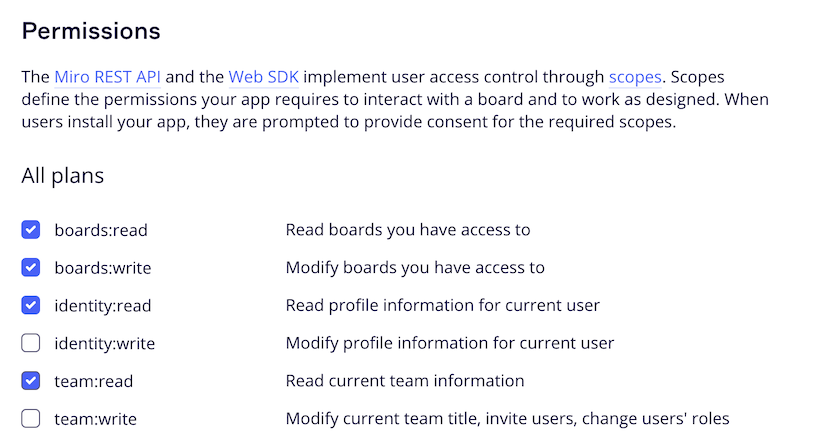

## Getting Started

### Deployment

#### Prerequisites

1. AWS account with access to create
    - [IAM roles](https://docs.aws.amazon.com/IAM/latest/UserGuide/id_roles.html)
    - [ECR](https://docs.aws.amazon.com/AmazonECR/latest/userguide/what-is-ecr.html) repositories
    - [Lambda functions](https://docs.aws.amazon.com/lambda/latest/dg/welcome.html)
    - [API Gateway](https://docs.aws.amazon.com/apigateway/latest/developerguide/welcome.html) endpoints
    - [S3 buckets](https://docs.aws.amazon.com/AmazonS3/latest/userguide/Welcome.html)
    - [CloudFront distributions](https://docs.aws.amazon.com/AmazonCloudFront/latest/DeveloperGuide/Introduction.html)
2. [AWS CLI](https://docs.aws.amazon.com/cli/latest/userguide/cli-chap-install.html) installed and configured
3. [NodeJS](https://nodejs.org/en/download/) installed
4. [NPM](https://www.npmjs.com/get-npm) installed
5. [AWS CDK](https://docs.aws.amazon.com/cdk/latest/guide/getting_started.html) installed
6. [Docker](https://docs.docker.com/get-docker/) installed

To begin integrating WATool with the Miro application, follow these steps to deploy infrastructure in your AWS account:

1. Configure CLI access to AWS account via [profile](https://docs.aws.amazon.com/cli/latest/userguide/getting-started-quickstart.html) or [environment variables](https://docs.aws.amazon.com/cli/latest/userguide/cli-configure-envvars.html)
2. Export AWS_REGION environment variable by run `export AWS_REGION='your region here'` (i.e. `export AWS_REGION='eu-north-1'`), as Lambda function deployment script relies on that
3. Bootstrap CDK stack in the target account: `cdk bootstrap aws://<account_id>/<region>`
4. Docker buildx is required to build Lambda images. It could be either used from [Docker Desktop](https://www.docker.com/products/docker-desktop/) package - no need in steps 4.i and 4.ii in this case; or installed separately (steps below developed and tested on [AWS Cloud9](https://aws.amazon.com/cloud9/)):
   1. [Binary installation manual](https://docs.docker.com/build/install-buildx/)
   2. To enable multiarch building capability launch `docker run --rm --privileged multiarch/qemu-user-static --reset -p yes`
5. For easy deployment just run `npm run deploy` from the project root folder. This will deploy all the necessary stacks in the target account.

### Miro Application

1. Familiarize yourself with Miro's Developer Platform:
   Visit the Miro Developer Platform documentation (**[https://developers.miro.com/docs](https://developers.miro.com/docs)**) to learn about the available APIs, SDKs, and other resources that can help you build your app.
2. Create [Miro Developer Team](https://developers.miro.com/docs/create-a-developer-team)

    

3. Go to the Miro Developer Dashboard (**[https://miro.com/app/dashboard/](https://miro.com/app/dashboard/)**
   ) and click "Create new app". Fill in the necessary information about your app, such as its name, select Developer team. Note: you don't need to check the "Expire user authorization token" checkbox. Click "Create app" to create your app.

    

    

4. Please enter the CloudFront URL that you obtained after the deployment process.

    

5. Add necessary permission.

    

6. Install the app to the team.
   
7. Back to the Miro Developer Dashboard, click "Apps" and start working with just installed app.
