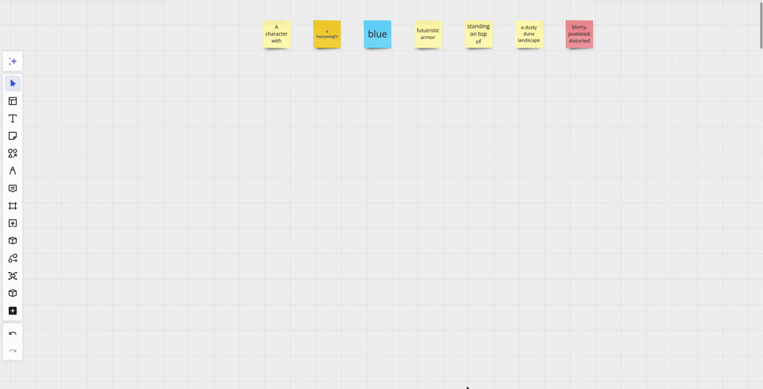
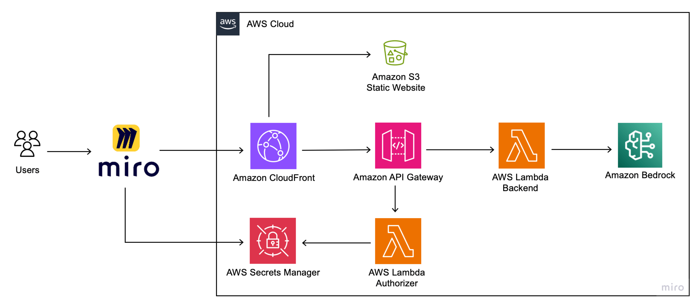

## Getting Started

 **This demo shows usecase of image generation on [Miro](https://miro.com/miro-aws/) board with [Amazon Bedrock](https://aws.amazon.com/bedrock/).** 


**Image generation**
<p align="center">

</p>


**Usage instructions:**

| Use case                | Details                                                                                                                                                                                                                                                                                                                                                      |
|-------------------------|--------------------------------------------------------------------------------------------------------------------------------------------------------------------------------------------------------------------------------------------------------------------------------------------------------------------------------------------------------------|
| 1. Image generation     | **On the board:** Select one or several stickers with generation prompts (any color except **red**), one or several stickers with negative prompts (**red**) **In the app:** Select scenario: "Generate". Select model, resolution and region, then click "Generate" button                                                                                  |
| 2. Image transformation | **On the board:** Select one or several stickers with transformation prompts (any color except **red**), one or several stickers with negative prompts (**red**) and a source image **In the app:** Select scenario: "Transform". Select model, resolution and region, then click "Transform" button                                                         |
| 3. Image inpainting     | **On the board:** Define changing part of image using **round** shape. Select one or several stickers with inpainting prompts (any color except **red**), one or several stickers with negative prompts (**red**), source image and round shape **In the app:** Select scenario: "Inpaint". Select model, resolution and region, then click "Inpaint" button |

Start from brainstorming and then develop your visual idea step-by-step.

 💡 ***Tips: you can use resulted image from previous step as an input for the next one.***


### Architecture overview

- **Miro application** is running on the board. Loaded from S3 bucket, accessed via CloudFront distribution. Written on TypeScript.
- **Authorization and AIML proxy lambdas.** Accessed via APIGateway deployed behind CloudFront. Written on Python.
   - ***Authorization function `authorize`*** provide access to backend functions only for authorized Miro application. It's used to protect organization data and generated content in AWS account.
   - ***AIML proxy function `mlInference`*** is required to handle API call from application and redirect it to Amazon Bedrock model.
 



### Deployment

#### Prerequisites

1. AWS account with access to create
    - [IAM roles](https://docs.aws.amazon.com/IAM/latest/UserGuide/id_roles.html)
    - [Lambda functions](https://docs.aws.amazon.com/lambda/latest/dg/welcome.html)
    - [API Gateway](https://docs.aws.amazon.com/apigateway/latest/developerguide/welcome.html) endpoints
    - [S3 buckets](https://docs.aws.amazon.com/AmazonS3/latest/userguide/Welcome.html)
    - [CloudFront distributions](https://docs.aws.amazon.com/AmazonCloudFront/latest/DeveloperGuide/Introduction.html)
2. [AWS CLI](https://docs.aws.amazon.com/cli/latest/userguide/cli-chap-install.html) installed and configured
3. [NodeJS](https://nodejs.org/en/download/) installed
4. [NPM](https://www.npmjs.com/get-npm) installed
5. [AWS CDK](https://docs.aws.amazon.com/cdk/latest/guide/getting_started.html) installed (min. version 2.94.x is required)
6. [Docker](https://docs.docker.com/get-docker/) installed

## To begin setup Generative AI demo in your AWS account, follow these steps:

### Start with creating Miro application

#### 1. Familiarize yourself with Miro's Developer Platform:
   Visit the Miro Developer Platform documentation (**[https://developers.miro.com/docs](https://developers.miro.com/docs)**) to learn about the available APIs, SDKs, and other resources that can help you build your app.
#### 2. Create [Miro Developer Team](https://developers.miro.com/docs/create-a-developer-team)
💡 If you already have ***Miro Developer Team*** in you account, skip this step.


#### 3. Go to the Miro App management Dashboard (**[https://miro.com/app/settings/user-profile/apps/](https://miro.com/app/settings/user-profile/apps/)**) 
and click "**Create new app**". 


Fill in the necessary information about your app, such as its name, select Developer team. Note: you don't need to check the "Expire user authorization token" checkbox. Click "**Create app**" to create your app.


#### 4. Copy client secret on app creation page


### Now everything ready to set up backend
#### 5. Configure CLI access to AWS account via [profile](https://docs.aws.amazon.com/cli/latest/userguide/getting-started-quickstart.html) or [environment variables](https://docs.aws.amazon.com/cli/latest/userguide/cli-configure-envvars.html)
   
   <details>
   <summary>👇 Demo operator user/role policies </summary>
   (steps below developed and tested in Cloud9 and Sagemaker, role with following policies)

   ```
   IAMFullAccess, AmazonS3FullAccess, AmazonSSMFullAccess, CloudWatchLogsFullAccess,
   CloudFrontFullAccess, AmazonAPIGatewayAdministrator, AWSCloudFormationFullAccess, 
   AWSLambda_FullAccess, AmazonBedrockFullAccess, AmazonSageMakerFullAccess
   ```

   </details>


#### 6. Bootstrap CDK stack in the target account: 
`cdk bootstrap aws://<account_id>/<region>`

#### 7. Docker buildx is required to build Graviton2 Lambda images on x86 platform. 
It could be either used from [Docker Desktop](https://www.docker.com/products/docker-desktop/) package - no need in steps 7.1 and 7.2 in this case; or installed separately (steps below developed and tested on [AWS Cloud9](https://aws.amazon.com/cloud9/)):
   1. [Binary installation manual](https://docs.docker.com/build/install-buildx/)
   2. On x86 platform to enable multiarch building capability launch
   
      `docker run --rm --privileged multiarch/qemu-user-static --reset -p yes`

#### 8. Configure Miro application client secret 
Edit `deployment-config.json` to authorize Miro application to access backend. Find the following parameter and put as value secret string you received in [step 4](#4-copy-client-secret-on-app-creation-page).
```
"clientAppSecret": "ADD_MIRO_APP_CLIENT_SECRET_HERE",
```

#### 9. Deploy backend
Run `npm run deploy` from the project root folder. You will be requested to provide ``application client secret`` to continue installation. When installation is completed, all the necessary resources are deployed as **CloudFormation** `DeployStack` in the target account. Write down CloudFront HTTPS distrubution address:
```
    DeployStack.DistributionOutput = xyz123456.cloudfront.net
```


#### 10. Return to Miro application creation dialog to complete app configuration
Please enter the CloudFront URL that you obtained on the previous step.


#### 11. Add necessary permission.


#### 12. Install the app to the team.


#### Back to the Miro Developer Dashboard, click "More apps" icon on application bar, find your just installed app in the list and start working.


### Bedrock models

**You need to request access to the Bedrock models you are planning to use in sufficient regions.**

Please follow [AWS documentation](https://docs.aws.amazon.com/bedrock/latest/userguide/getting-started.html) to request access.
Models used in this sample defined in **`./frontend/src/data/scenarios.json`** file, available regions and resolutions per model defined in **`./frontend/src/data/regions.json`** and **`./frontend/src/data/resolutions.json`**.
Based on your selection of models and regions you can update this files to keep frontend options consistent.


### Sagemaker endpoints (optional)

Previous version of the sample (basic frontend and Sagemaker enpoints only support) could be found in the dedicated [repo branch](https://github.com/aws-samples/generative-ai-demo-on-miro/tree/sagemaker-endpoints-only)

**You may run dedicated Sagemaker endpoints if you'd like to run your own use-cases.**
Each of sample use-cases is supported by a separate Jupyter notebook in **`./ml_services/<use_case>`** subdirectory:
- `1-create_image` image generation (Stable diffusion 2.1), based on [this example](https://github.com/aws/studio-lab-examples/blob/main/generative-deep-learning/stable-diffusion-finetune/JumpStart_Stable_Diffusion_Inference_Only.ipynb)
- `2-inpaint_image` image inpainting (Stable diffusion 2 Inpainting fp16), based on [this example](https://github.com/aws/amazon-sagemaker-examples/blob/main/introduction_to_amazon_algorithms/jumpstart_inpainting/Amazon_JumpStart_Inpainting.ipynb)
- `3-modify_image` image pix2pix modification (Huggingface instruct pix2pix), based on [this example](https://github.com/aws/amazon-sagemaker-examples/tree/main/advanced_functionality/huggingface_deploy_instructpix2pix)

 💡 ***These steps developed and tested in Sagemaker notebook. For cases 1 and 2 you also can use any other ways to run Jumpstart referenced models, i.e. Sagemaker Studio***


#### Starting Sagemaker endpoints

- Go to **./ml_services/<use_case>** directory and run one-by-one all three Sagemaker notebooks.
- After endpoint started and successfully tested in notebook, go to **Miro board**, select required items and run use-case.


### Demo extension with additional use-cases

The demo could be extended in various ways, e.g. by adding new use-cases, changing interface or improving existing functionality.
Existing environment can be used as boilerplate.

### License

This library is licensed under the [MIT-0](https://github.com/aws/mit-0) license. For more details, please see [LICENSE](LICENSE) file

### Legal disclaimer

Sample code, software libraries, command line tools, proofs of concept, templates, or other related technology are provided as AWS Content or Third-Party Content under the AWS Customer Agreement, or the relevant written agreement between you and AWS (whichever applies). You should not use this AWS Content or Third-Party Content in your production accounts, or on production or other critical data. You are responsible for testing, securing, and optimizing the AWS Content or Third-Party Content, such as sample code, as appropriate for production grade use based on your specific quality control practices and standards. Deploying AWS Content or Third-Party Content may incur AWS charges for creating or using AWS chargeable resources, such as running Amazon EC2 instances or using Amazon S3 storage.
